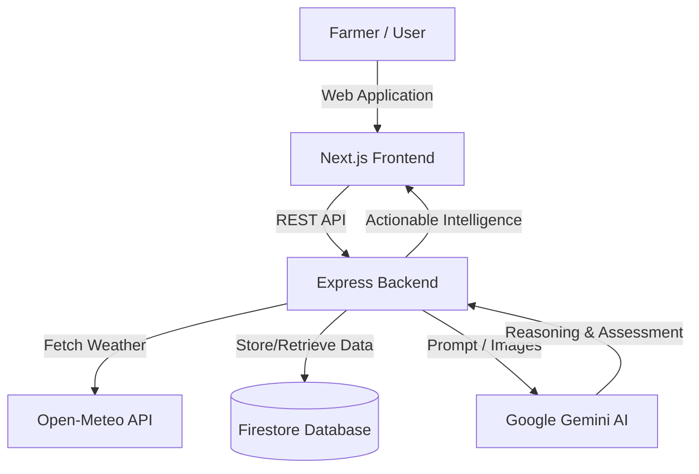

# AgriNexus

> An interoperable digital agriculture intelligence network that combines localized farm context, environmental data, and AI-assisted reasoning to provide actionable, evidence-backed recommendations for farmers.


---

## 📖 Project Overview

AgriNexus is a farmer-focused agricultural intelligence platform designed to bridge the gap between complex agricultural data and actionable farm-level insights. It empowers small and marginal farmers by aggregating fragmented information—such as weather forecasts, soil context, crop growth stages, and earth-observation data—into a unified **Digital Farm Twin**.

Using a powerful AI engine, AgriNexus continuously analyzes this context to answer what changed, why it changed, and what the farmer should do next. In addition to farm-level intelligence, it provides a foundation for an agricultural **Cooperation Layer**, defining a common agricultural data exchange schema for standardized cross-border or cross-system intelligence sharing.

---

## 🎯 Problem Statement

The agricultural industry faces several critical challenges, especially for small-scale farmers:
- **Fragmented Data:** Agricultural intelligence is scattered across disparate weather, soil, crop, and satellite tracking systems.
- **Complexity:** Raw data is difficult to interpret and convert into actionable, localized farming decisions.
- **Weather and Soil Uncertainty:** Rapidly changing climate variables and unmonitored soil conditions increase farming risks.
- **Lack of Provenance:** Existing AI tools often hallucinate or provide recommendations without transparent, verifiable evidence.
- **Interoperability:** Datasets across different regions and countries use vastly different schemas, making large-scale cooperation and data exchange difficult.

The AgriNexus project aims to normalize this heterogeneous data into an understandable format and deliver precise, actionable insights.

---

## 💡 Solution

AgriNexus addresses these challenges by processing diverse agricultural signals through a unified AI layer that returns localized, evidence-backed advisories. 

```text
Farmer / Farm Profile
         ↓
External Data Ingestion (Weather, Soil, Satellite)
         ↓
Digital Farm Twin Representation
         ↓
AI & Vision Processing Layer
         ↓
Evidence-Backed Agricultural Advisory
         ↓
Actionable Recommendations for the Farmer
```

---

## ✨ Key Features

| Feature | Description | Status |
| ------- | ----------- | ------ |
| **Farmer Profile & Auth** | Firebase-powered authentication and user management. | Implemented |
| **Farm Management** | CRUD operations for farm location, area, and configuration. | Implemented |
| **Digital Farm Twin** | Unified state representation of crop, soil, and weather. | Implemented |
| **Weather Intelligence** | Hyper-local 7-day weather forecasts utilizing Open-Meteo. | Implemented |
| **AI Agricultural Advisory** | AI recommendations with explicit reasoning and evidence based on real farm state. | Implemented |
| **Disease Intelligence** | Vision AI model to assess crop images and detect potential diseases/pests. | Implemented |
| **Soil & Crop Health** | Integration of soil condition indicators and crop planning data. | Implemented |
| **Cooperation Exchange** | Shared data schemas for interoperable intelligence exchange. | Implemented |
| **Historical Data Analysis** | Trend tracking over time for NDVI and soil conditions. | Planned |

---

## 🔄 System Workflow



---

## 🏗️ Architecture

### Frontend
Built with **Next.js (React 19)**, **Tailwind CSS**, and **Framer Motion**, the frontend provides a mobile-responsive, dynamic dashboard where farmers and agronomists can track crop health, request AI advice, and upload imagery for disease diagnosis.

### Backend
Powered by **Node.js, Express 5, and TypeScript**. The backend processes business logic, validates API requests using **Zod**, applies rate limiting via **Redis**, and routes requests to the appropriate internal services.

### Database
**Firebase Firestore** acts as the primary NoSQL document database, storing farm profiles, advisories, disease assessments, and user configurations securely.

### AI Layer
The backend integrates with **Google Gemini (genai)** for both structural reasoning (Advisory) and computer vision (Disease Assessment), strictly bounding the AI's output using validated farm constraints to prevent hallucination.

---

## 🛠️ Technology Stack

| Layer | Technology | Purpose |
| ----- | ---------- | ------- |
| **Frontend** | Next.js, React, Tailwind CSS | UI routing, state management, and responsive styling |
| **Backend** | Express (v5), Node.js, TypeScript | API architecture, controllers, and services |
| **Database** | Firebase Firestore | NoSQL document storage |
| **Authentication** | Firebase Auth | Secure user authentication and session management |
| **AI / ML** | Google Gemini 2.5 Pro | AI Advisory logic and crop disease visual assessment |
| **Rate Limiting** | Redis | Caching and API abuse prevention |
| **Containerization** | Docker, Docker Compose | Consistent local running environment |

---

## 📁 Project Structure

```text
AgriNexus/
├── backend/
│   ├── src/
│   │   ├── config/        # Environment, Firebase, and Redis config
│   │   ├── controllers/   # Route handlers (Farm, Weather, Disease, etc.)
│   │   ├── middlewares/   # Authentication, Rate limiting, Error handling
│   │   ├── routes/        # Express route definitions
│   │   ├── services/      # AI, Vision, Weather, and Farm services
│   │   └── utils/         # Logging and utilities
│   ├── Dockerfile
│   └── package.json
├── frontend/
│   ├── public/
│   ├── src/
│   │   ├── app/           # Next.js App Router (Dashboard, Auth, etc.)
│   │   ├── components/    # Reusable UI components
│   │   ├── context/       # React Context (AuthContext)
│   │   └── lib/           # Utility functions
│   ├── next.config.ts
│   └── package.json
├── docs/                  # Architecture, PRD, API, and Security specs
├── docker-compose.yml
└── README.md
```

---

## 🚀 Installation & Running Locally

### Prerequisites
- Node.js (v20+ recommended)
- npm (v10+)
- Docker & Docker Compose (optional, for running Redis via containers)

### 1. Clone the Repository
```bash
git clone <YOUR_REPOSITORY_URL>
cd AgriNexus
```

### 2. Install Dependencies

**For Backend:**
```bash
cd backend
npm install
```

**For Frontend:**
```bash
cd ../frontend
npm install
```

### 3. Running Locally (Development Mode)

First, ensure a Redis server is running locally on port `6379`. You can use the provided Docker Compose file from the root directory:
```bash
docker-compose up -d redis
```

Start the **Backend**:
```bash
cd backend
npm run dev
```

Start the **Frontend**:
```bash
cd frontend
npm run dev
```

- Frontend operates at: `http://localhost:3000`
- Backend operates at: `http://localhost:5000`

---

## 🔐 Environment Variables

You must create environment configuration files for both the frontend and backend.

### Backend (`backend/.env`)
Copy the provided `.env.example` to `.env`:

| Variable | Required | Purpose |
| -------- | -------- | ------- |
| `PORT` | No | API Port (Defaults to 5000) |
| `FIREBASE_PROJECT_ID` | Yes | Your Firebase Project ID |
| `FIREBASE_CLIENT_EMAIL` | Yes | Firebase Admin Client Email |
| `FIREBASE_PRIVATE_KEY` | Yes | Firebase Admin Private Key |

### Frontend (`frontend/.env.local`)
Create a `.env.local` file inside the `frontend` folder with your Firebase client credentials:

| Variable | Required | Purpose |
| -------- | -------- | ------- |
| `NEXT_PUBLIC_FIREBASE_API_KEY` | Yes | Firebase Client API Key |
| `NEXT_PUBLIC_FIREBASE_AUTH_DOMAIN` | Yes | Firebase Auth Domain |
| `NEXT_PUBLIC_FIREBASE_PROJECT_ID`| Yes | Firebase Project ID |
| `NEXT_PUBLIC_API_URL`            | No  | Backend API URL (Defaults to localhost:5000) |

*(Do not expose real private keys to version control!)*

---

## 🔌 API Documentation

The backend exposes a structured version 1 REST API at `/api/v1`. All endpoints below (except authentication hooks) require a valid Firebase Auth `Bearer` token.

| Method | Endpoint | Purpose | Auth |
| ------ | -------- | ------- | ---- |
| `GET`  | `/api/v1/farms` | List all farms belonging to the user | Yes |
| `POST` | `/api/v1/farms` | Create a new farm profile | Yes |
| `GET`  | `/api/v1/farms/:farmId/weather` | Retrieve hyper-local weather conditions | Yes |
| `POST` | `/api/v1/farms/:farmId/advisories/generate` | Generate AI context-based agricultural advice | Yes |
| `GET`  | `/api/v1/farms/:farmId/advisories` | List previously generated advisories | Yes |
| `POST` | `/api/v1/disease/analyze` | Upload crop image (`multipart/form-data`) for AI diagnosis | Yes |
| `GET`  | `/api/v1/disease/:analysisId` | Retrieve a previous disease analysis | Yes |

---

## 🗄️ Database Structure

AgriNexus utilizes **Firebase Firestore**. Key collections include:

- **`farms`**: Stores farm profiles, boundaries/coordinates, current crop type, and soil types.
- **`advisories`**: Stores AI-generated historical advice, retaining the reasoning, explicit evidence, and conditions present at the exact time of generation.
- **`diseaseAnalyses`**: Stores image metadata, visual AI indicators, model confidence, and diagnosis recommendations.

---

## 🛡️ Security

The application implements standard security measures for modern web applications:
- **Authentication:** Controlled via Firebase Auth.
- **Authorization:** Handled in the backend. Users can only access farms, fields, and records belonging to their `uid`.
- **API Protection:** `helmet` is installed for setting secure HTTP headers. `cors` is properly restricted.
- **Rate Limiting:** `express-rate-limit` combined with Redis handles basic IP-based rate limiting to prevent DDOS and abuse.
- **Validation:** Strict payload and parameter validation is powered by `zod`.

---

## ⚠️ Limitations

- **External API Dependency:** Weather intelligence explicitly depends on the availability of the `Open-Meteo` API. The backend provides simulated fallback data if this API fails.
- **Diagnostic Confidence:** The AI disease intelligence feature operates as an advisory tool only. It does not provide guaranteed diagnoses and communicates uncertainty explicitly.
- **Data Coverage:** Soil and vegetation functionality currently uses estimated or fallback sets depending on geographic coordinates.

---

## 🧪 Testing

Automated tests are not currently included in the repository. Validation of routes and features can be verified locally through manual integration and frontend use.

---

## 🐳 Docker Deployment

The repository includes a `Dockerfile` for the Node.js backend.

To build and run the backend via Docker:
```bash
cd backend
docker build -t agrinexus-backend .
docker run --env-file .env -p 5000:5000 agrinexus-backend
```

*Note: For full operation, a Redis instance is still required (either through a networked container or a managed cloud instance).*

---

## 📄 License

This project is licensed under the **ISC License**.

---

## 📌 Project Status

**Status:** Active Development (Hackathon MVP Complete)

The current repository contains the end-to-end functionality documented above, actively demonstrating the Observe → Understand → Recommend → Act loop required by the product specifications.
